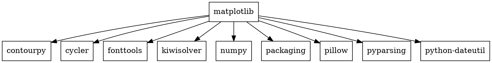

# Практика №2

## Задание 1
Установка:
- С помощью менеджера пакетов:
```bash
pip install matplotlib
```
- Прямо из репозитория:
```bash
git clone https://github.com/matplotlib/matplotlib.git
cd matplotlib
pip install .
```

Вывести служебную информацию:
```bash
pip show matplotlib
```


## Задание 2
Установка:
- С помощью менеджера пакетов:
```bash
npm install express
```
- Прямо из репозитория:
```bash
git clone https://github.com/expressjs/express.git
cd express
npm install .
```

Вывести служебную информацию:
```bash
npm show express
```


## Задание 3
### Matplotlib
- graphviz-код matplotlib

- Формирование dot-файла пакета matplotlib
```
pipdeptree -p matplotlib --graph-output dot > matplotlib_deps.dot
```

- Получение изображения зависимостей
```bash
dot -Tpng matplotlib_deps.dot -o matplotlib_deps.png
```
- -Tpng - расширение выходного файла
- -o - имя выходного файла


### Express
- graphviz-код express

```graphviz
digraph ExpressDeps {
    node [shape=box];

    "express" -> "accepts";
    "express" -> "array-flatten";
    "express" -> "body-parser";
    "express" -> "content-disposition";
    "express" -> "content-type";
    "express" -> "cookie";
    "express" -> "cookie-signature";
    "express" -> "debug";
    "express" -> "depd";
    "express" -> "encodeurl";
    "express" -> "escape-html";
    "express" -> "etag";
    "express" -> "finalhandler";
    "express" -> "fresh";
    "express" -> "http-errors";
    "express" -> "merge-descriptors";
    "express" -> "methods";
    "express" -> "on-finished";
    "express" -> "parseurl";
    "express" -> "path-to-regexp";
    "express" -> "proxy-addr";
    "express" -> "qs";
    "express" -> "range-parser";
    "express" -> "safe-buffer";
    "express" -> "send";
    "express" -> "serve-static";
    "express" -> "setprototypeof";
    "express" -> "statuses";
    "express" -> "type-is";
    "express" -> "utils-merge";
    "express" -> "vary";

    "accepts" [label="accepts"];
    "array-flatten" [label="array-flatten"];
    "body-parser" [label="body-parser"];
    "content-disposition" [label="content-disposition"];
    "content-type" [label="content-type"];
    "cookie" [label="cookie"];
    "cookie-signature" [label="cookie-signature"];
    "debug" [label="debug"];
    "depd" [label="depd"];
    "encodeurl" [label="encodeurl"];
    "escape-html" [label="escape-html"];
    "etag" [label="etag"];
    "finalhandler" [label="finalhandler"];
    "fresh" [label="fresh"];
    "http-errors" [label="http-errors"];
    "merge-descriptors" [label="merge-descriptors"];
    "methods" [label="methods"];
    "on-finished" [label="on-finished"];
    "parseurl" [label="parseurl"];
    "path-to-regexp" [label="path-to-regexp"];
    "proxy-addr" [label="proxy-addr"];
    "qs" [label="qs"];
    "range-parser" [label="range-parser"];
    "safe-buffer" [label="safe-buffer"];
    "send" [label="send"];
    "serve-static" [label="serve-static"];
    "setprototypeof" [label="setprototypeof"];
    "statuses" [label="statuses"];
    "type-is" [label="type-is"];
    "utils-merge" [label="utils-merge"];
    "vary" [label="vary"];
}
```


- Формирование dot-файла пакета express
```
npm ls -a --json | jq '{name: .name, dependencies: {express: .dependencies.express}}' | npm2dot > express_deps.dot
```

- Получение изображения зависимостей
```bash
dot -Tpng express_deps.dot -o express_deps.png
```
- -Tpng - расширение выходного файла
- -o - имя выходного файла


## Задание 4
Код MiniZinc
```MiniZinc
include "globals.mzn";
var 0..9: a;
var 0..9: b;
var 0..9: c;
var 0..9: d;
var 0..9: e;
var 0..9: f;

constraint a + b + c == d + e + f;
constraint all_different([a, b, c, d, e, f]);

solve minimize a + b + c;
```


## Задание 5
Код MiniZinc
```MiniZinc
set of int: Root = {1};
set of int: Menu_Versions = {150, 140, 130, 120, 110, 100}; 
set of int: Dropdown_Versions = {230, 220, 210, 200, 180}; 
set of int: Icons_Versions = {200, 100};  

var Menu_Versions: menu_version;
var Root: root;
var Dropdown_Versions: dropdown_version;
var Icons_Versions: icons_version;

constraint
    if root = 1 then
        (menu_version = 100 \/ menu_version = 150 \/ icons_version = 100) endif;

constraint
    if (menu_version = 150 \/ menu_version = 140 \/ menu_version = 130 \/ 
     menu_version = 120 \/ menu_version = 110) then
        (dropdown_version = 230 \/ dropdown_version = 200) endif;

constraint
    if menu_version = 100 then dropdown_version = 180 endif;

constraint
    if (dropdown_version = 230 \/ dropdown_version = 220 \/ 
     dropdown_version = 210 \/ dropdown_version = 200) then
        icons_version = 200 endif;
    
solve satisfy;
```


## Задание 6
Код MiniZinc
```MiniZinc
int: root = 100;
var 100..300: foo;
var 100..300: target;
var 100..300: right;
var 100..300: left;
var 100..300: shared;


constraint
    if root = 100 then
        (foo >= 100 /\ foo < 200) /\ (target >= 200 /\ target < 300) endif;

constraint
    if (foo = 110) then
        (left >= 100 /\ left < 200) /\ (right >= 100 /\ right < 200) endif;
        
constraint    
    if (foo = 100) then true endif;
    
constraint
    if (left = 100) then
        shared >= 100 endif;    
        
constraint
    if (right = 100) then
        shared < 200 endif;    
        
constraint    
    if (shared = 200) then true endif;

constraint
    if (shared = 100) then
       (target >= 100 /\ target < 200) endif;   
     
constraint    
    if (target = 100 \/ target = 200) then true endif;
    
solve satisfy;
```


## Задание 7

- Код решения на python
```python
import re
from collections import defaultdict


def parse_dependencies(file_path):
    dependencies = defaultdict(dict)

    with open(file_path, 'r') as file:
        for line in file:
            if ' - ' not in line:
                continue

            package_info, deps = line.split(" - ")
            package, version = package_info.split()

            dep_dict = {}
            if deps.strip():
                for dep in deps.split():
                    match = re.match(r'([a-zA-Z0-9_]+)\s*([^\s]*)', dep)
                    if match:
                        dep_name = match.group(1)
                        dep_version = match.group(2)
                        dep_dict[dep_name.strip()] = dep_version.strip()

            dependencies[package] = {
                "version": version,
                "dependencies": dep_dict
            }

    return dependencies


def find_solution(dependencies):
    resolved_versions = {}
    solution = {}

    def can_resolve(package, current_versions):
        if package in solution:
            return True
        package_info = dependencies.get(package)
        if not package_info:
            return False

        package_version = package_info["version"]
        package_deps = package_info["dependencies"]

        for dep_name, dep_version_constraint in package_deps.items():
            if dep_name in current_versions:
                if not version_satisfies_constraint(current_versions[dep_name], dep_version_constraint):
                    return False
            else:
                current_versions[dep_name] = dep_version_constraint

                if not can_resolve(dep_name, current_versions):
                    return False

        solution[package] = package_version
        return True

    for package in dependencies:
        if not can_resolve(package, resolved_versions):
            print(f"Не удалось разрешить зависимости для пакета {package}")
            return None

    return solution


def version_satisfies_constraint(version, constraint):
    constraint_version = constraint.lstrip('^>=')
    if constraint.startswith('>='):
        return version >= constraint_version
    elif constraint.startswith('^'):
        return version >= constraint_version
    elif constraint.startswith('<'):
        return version < constraint_version
    else:
        return version == constraint_version


file_path = 'dependencies.txt'
dependencies = parse_dependencies(file_path)
solution = find_solution(dependencies)

if solution:
    print("Найдено решение:")
    for package, version in solution.items():
        print(f"{package}: {version}")
else:
    print("Решение не найдено")
```
- txt файл имеет следующий вид
```txt
<package> <version> - <dependency_1> <version_constraint> <dependency_2> <version_constraint> ...
...
```
- Пример txt файла
```txt
root 1.0.0 - foo ^1.0.0 target ^2.0.0
foo 1.1.0 - left ^1.0.0 right ^1.0.0
foo 1.0.0 -
left 1.0.0 - shared >=1.0.0
right 1.0.0 - shared <2.0.0
shared 2.0.0 -
shared 1.0.0 - target ^1.0.0
target 2.0.0 - 
target 1.0.0 -
```
- Пример вывода
  


