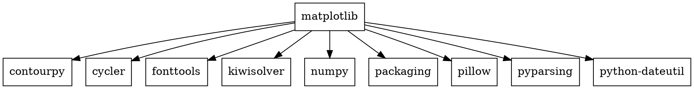

# Практика №2

## Задание 1
Установка:
- С помощью менеджера пакетов:
```bash
pip install matplotlib
```
- Прямо из репозитория:
```bash
git clone https://github.com/matplotlib/matplotlib.git
cd matplotlib
pip install .
```

Вывести служебную информацию:
```bash
pip show matplotlib
```


--


## Задание 2
Установка:
- С помощью менеджера пакетов:
```bash
npm install express
```
- Прямо из репозитория:
```bash
git clone https://github.com/expressjs/express.git
cd express
npm install .
```

Вывести служебную информацию:
```bash
npm show express
```


## Задание 3
### Matplotlib
- graphviz-код matplotlib

- Получение изображения зависимостей
```bash
dot -Tpng matplotlib_deps.dot -o matplotlib_deps.png
```
- -Tpng - расширение выходного файла
- -o - имя выходного файла


### Express
- graphviz-код express

```graphviz
digraph ExpressDeps {
    node [shape=box];

    "express" -> "accepts";
    "express" -> "array-flatten";
    "express" -> "body-parser";
    "express" -> "content-disposition";
    "express" -> "content-type";
    "express" -> "cookie";
    "express" -> "cookie-signature";
    "express" -> "debug";
    "express" -> "depd";
    "express" -> "encodeurl";
    "express" -> "escape-html";
    "express" -> "etag";
    "express" -> "finalhandler";
    "express" -> "fresh";
    "express" -> "http-errors";
    "express" -> "merge-descriptors";
    "express" -> "methods";
    "express" -> "on-finished";
    "express" -> "parseurl";
    "express" -> "path-to-regexp";
    "express" -> "proxy-addr";
    "express" -> "qs";
    "express" -> "range-parser";
    "express" -> "safe-buffer";
    "express" -> "send";
    "express" -> "serve-static";
    "express" -> "setprototypeof";
    "express" -> "statuses";
    "express" -> "type-is";
    "express" -> "utils-merge";
    "express" -> "vary";

    "accepts" [label="accepts"];
    "array-flatten" [label="array-flatten"];
    "body-parser" [label="body-parser"];
    "content-disposition" [label="content-disposition"];
    "content-type" [label="content-type"];
    "cookie" [label="cookie"];
    "cookie-signature" [label="cookie-signature"];
    "debug" [label="debug"];
    "depd" [label="depd"];
    "encodeurl" [label="encodeurl"];
    "escape-html" [label="escape-html"];
    "etag" [label="etag"];
    "finalhandler" [label="finalhandler"];
    "fresh" [label="fresh"];
    "http-errors" [label="http-errors"];
    "merge-descriptors" [label="merge-descriptors"];
    "methods" [label="methods"];
    "on-finished" [label="on-finished"];
    "parseurl" [label="parseurl"];
    "path-to-regexp" [label="path-to-regexp"];
    "proxy-addr" [label="proxy-addr"];
    "qs" [label="qs"];
    "range-parser" [label="range-parser"];
    "safe-buffer" [label="safe-buffer"];
    "send" [label="send"];
    "serve-static" [label="serve-static"];
    "setprototypeof" [label="setprototypeof"];
    "statuses" [label="statuses"];
    "type-is" [label="type-is"];
    "utils-merge" [label="utils-merge"];
    "vary" [label="vary"];
}
```

- Получение изображения зависимостей
```bash
dot -Tpng express_deps.dot -o express_deps.png
```
- -Tpng - расширение выходного файла
- -o - имя выходного файла


